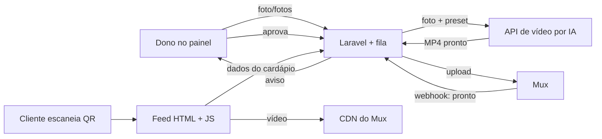

# Degustou Cardápio — Project Description

## Overview

**Degustou Cardápio** é uma plataforma própria de cardápio em vídeo no estilo Instagram Reels. O cliente do restaurante escaneia um **QR Code na mesa** e cai num **feed vertical**, um prato por tela, com vídeo em autoplay mudo e loop. Para cada prato, o dono do restaurante escolhe entre duas origens de vídeo: enviar uma **foto (ou 3–4 fotos, em ângulos diferentes)** que uma IA transforma em um clipe curto sempre no mesmo preset visual, ou enviar um **vídeo próprio** já gravado, que vai direto para hospedagem sem passar pela IA.

O produto é **só de visualização** — o pedido continua sendo feito com o garçom, sem carrinho, pagamento ou envio para cozinha. O valor para o cliente na mesa é ver o prato "vivo" antes de pedir; o valor para o dono é ter um cardápio com cara moderna sem gravar nada, poder destacar pratos, mudar preço ou marcar esgotado na hora, e enxergar quais pratos chamam mais atenção (visualizações e tempo assistido).

O modelo comercial é **SaaS por assinatura via Stripe** (Laravel Cashier), com um plano gratuito de entrada e planos pagos que limitam quantidade de pratos e de gerações de vídeo por IA. Existem dois painéis: o **painel do restaurante** (uso do dono, mobile-first) e o **painel administrativo** (super admin, sugestão de implementação em Filament). A hospedagem de vídeo é no **Mux** (plano B: Cloudflare Stream), escolhido pelo custo dentro da franquia gratuita e a menor fatura projetada em escala.

**Limite do MVP (Fase 2):** painel do restaurante completo, geração por IA com aprovação obrigatória do dono (inclusive a partir de múltiplas fotos/ângulos), upload de vídeo próprio, integração com Mux, QR Code, visualizações básicas, assinaturas via Stripe com saldo de gerações e pacotes extras, e painel administrativo com restaurantes, planos, assinaturas, gerações e custos. Ficam **fora do escopo**: pedido/carrinho, pagamento e delivery, app nativo, e modelo 3D interativo do prato.

A estratégia é validar com restaurantes reais (começando em Ji-Paraná) antes de construir tudo: Fase 0 são testes rápidos de qualidade de vídeo e performance; Fase 1 é um piloto gratuito com 2–3 restaurantes reais medindo interesse de pagamento (critério: pelo menos 3 de 10 donos dispostos a pagar); só então entra a Fase 2 (MVP completo) e a Fase 3 (escala com cadastro self-service).

### Key Concepts

- **Restaurante:** conta dona do cardápio (`restaurants`), com nome, slug, logo, cor de destaque, fonte, plano ativo e status (ativo/suspenso).
- **Prato (`dishes`):** item do cardápio dentro de uma categoria, com nome, preço, descrições, ordem, status (ativo, esgotado, oculto), selos (novo, mais pedido, vegetariano) e variações (`dish_variants`).
- **Categoria (`categories`):** agrupador fixo no topo do feed; trocar de categoria troca os vídeos exibidos e volta ao primeiro prato dela.
- **Feed:** experiência do cliente na mesa — HTML servido + JS leve (sem Livewire), rolagem vertical estilo Reels via CSS scroll-snap e IntersectionObserver, um prato por tela.
- **Vídeo (`videos`):** clipe ativo de um prato, de origem IA ou upload, com `mux_asset_id`/`mux_playback_id`, capa, duração e status (processando, aguardando aprovação, aprovado, rejeitado). Cada prato tem no máximo um vídeo aprovado ativo.
- **Geração de vídeo por IA (`video_generations`):** job que envia 1 foto (ou 3–4 fotos/ângulos, no MVP) e um preset fixo para uma API de imagem-para-vídeo, produzindo 2–3 variações para o dono escolher; nunca vai ao ar sem aprovação.
- **Preset de IA (`ai_presets`):** configuração fixa de prompt, movimento de câmera (giro 30–45° com leve aproximação), efeitos sutis (vapor/brilho) e duração (5–10s, vertical 9:16); o dono não escreve prompt.
- **Saldo de gerações (`generation_balances` / `generation_ledger`):** cada plano paga tem um saldo mensal que renova na renovação da assinatura e não acumula; gerações avulsas compradas não expiram e são consumidas depois do saldo mensal. 1 geração = 1 clipe gerado (pedir 3 variações consome 3 gerações). Geração com erro do provedor não consome saldo. **O plano gratuito tem 5 gerações únicas, concedidas uma única vez (degustação), sem renovar.**
- **Plano (`plans`):** nível de assinatura (Grátis, Básico, Pro) com preço, limite de pratos, gerações por mês, e recursos liberados (ex.: remoção da marca "feito com", nível de métricas de visualização). Preço, limites e pacotes avulsos de gerações **não são fixos nesta spec** — são cadastrados e editados pelo super admin no painel administrativo, já integrado com a Stripe (sem precisar de deploy para mudar valores).
- **Painel do restaurante:** área do dono (mobile-first, Laravel + Livewire) para gerenciar categorias, pratos, vídeos, aparência, QR Code, visualizações e assinatura.
- **Painel administrativo (super admin):** área `/admin`, restrita ao papel `super_admin`, para gestão de restaurantes, planos, assinaturas, fila de gerações, presets de IA, moderação de conteúdo, custos e cupons.
- **Visualização (`dish_views`):** registro de sessão + segundos assistidos por prato, usado para o dono ver pratos mais vistos e tempo médio assistido; gravado em lote/agregado por dia para não pesar o banco.

## Tech Stack

| Camada | Tecnologia | Observação |
| --- | --- | --- |
| Painel do restaurante | Laravel + Livewire | Mobile-first |
| Painel administrativo | Filament (sugestão, sobre Livewire) | Área `/admin`, papel `super_admin` |
| Feed do cliente | HTML servido pelo backend + JS leve (CSS scroll-snap, IntersectionObserver) | Sem Livewire no feed, para rolagem líquida |
| Fila de jobs | Laravel Queues | Geração por IA e upload processados de forma assíncrona |
| Geração de vídeo por IA | Provedor genérico/plugável por trás de uma abstração (`ai_presets.provedor`) | Runway Gen-4 Turbo como referência de custo ($0,05/s); provedor concreto é configuração, não hardcode — troca sem mudar o fluxo |
| Hospedagem/streaming de vídeo | Mux | Plano B: Cloudflare Stream |
| Pagamentos/assinaturas | Stripe via Laravel Cashier | Checkout em modo assinatura (BRL, cartão de crédito apenas) + Portal do cliente + Checkout modo pagamento único para pacotes avulsos |
| Vídeo no feed | MP4 otimizado (faststart) | Formato inicial por simplicidade/velocidade de início; revisar para HLS depois se a medição em produção pedir |
| Infraestrutura | A definir — **não será Laravel Cloud** | Vídeo nunca fica armazenado no servidor da aplicação, independente do host escolhido |
| Banco de dados | A definir | Depende do provedor de infra escolhido |

## Core Workflows

### 1. Cliente visualiza o cardápio pelo QR Code

1. Cliente escaneia o QR Code na mesa e abre o feed (sem app, sem login).
2. O HTML já vem do servidor com a capa do primeiro prato e o link do primeiro vídeo embutido (sem esperar o JS); `preconnect` é feito para o CDN do Mux.
3. Vídeo toca em autoplay, mudo, em loop; cliente pode ativar o som. Nome, preço e descrição curta ficam sobre o vídeo; um painel que sobe de baixo mostra o detalhe completo.
4. Cliente rola verticalmente (scroll-snap) para o próximo prato da categoria atual, ou toca numa categoria na barra fixa do topo para trocar o conjunto de vídeos e voltar ao primeiro prato dela.
5. Selos (novo, mais pedido, vegetariano) e status esgotado aparecem sobre o card do prato.
6. Metas de performance: capa em menos de 1s, vídeo tocando em menos de 2s no 4G, troca de prato instantânea; pré-carga limitada aos 1–2 próximos vídeos; qualidade inicial 480p subindo para 720p; service worker cacheia capas e primeiro vídeo para retorno.
7. Tempo assistido e visualizações são registrados (`dish_views`) para alimentar as métricas do dono.

### 2. Dono cadastra um prato e gera vídeo por IA

1. No painel do restaurante, o dono cria/edita um prato: fotos, nome, preço, descrições, selos, variações.
2. Na tela de vídeo do prato, escolhe "gerar com IA": envia 1 foto (mínimo) ou 3–4 fotos em ângulos diferentes (recomendado, incluído no MVP para melhorar o resultado do giro).
3. Um job entra na fila (Laravel Queues) e chama a API de imagem-para-vídeo com o preset fixo (`ai_presets`), sem giro 360° completo a partir de fotos únicas — o giro maior só é usado quando há múltiplos ângulos enviados.
4. A API retorna 2–3 variações; o painel mostra o consumo de saldo de gerações antes de confirmar e bloqueia a geração se o saldo estiver zerado, oferecendo upgrade ou compra de pacote extra.
5. MP4 pronto é enviado ao Mux; webhook do Mux marca o vídeo como pronto e avisa o dono.
6. Dono revisa as variações, escolhe uma (ou pede para gerar de novo) e aprova — nada vai ao ar sem essa aprovação explícita.
7. Prato aprovado passa a aparecer no feed do cliente.

### 3. Dono envia vídeo próprio

1. No mesmo fluxo de vídeo do prato, o dono escolhe "enviar vídeo próprio" em vez de gerar por IA.
2. Upload vai direto do celular do dono para o Mux, sem passar pela IA nem pelo servidor da aplicação, e sem consumir saldo de gerações.
3. Recomendações mostradas no envio: vertical, 5 a 15 segundos, prato em destaque; vídeos fora do padrão são cortados ou recusados.
4. Fluxo de aprovação e publicação no feed segue igual ao vídeo gerado por IA (webhook do Mux → aviso → aprovação do dono → publicação).

### 4. Assinatura, upgrade e consumo de saldo (Stripe)

1. Dono cria a conta sozinho e começa no **plano Grátis**, com 5 gerações de degustação concedidas uma única vez (não renovam).
2. Para fazer upgrade, o painel abre um **Stripe Checkout em modo assinatura** (BRL, apenas cartão de crédito — sem Pix/boleto no MVP) para o plano Básico ou Pro.
3. Webhooks da Stripe sincronizam: pagamento confirmado, assinatura criada/alterada/cancelada, pagamento falhou.
4. No webhook de fatura paga, o saldo mensal de gerações é zerado e recarregado conforme o plano (saldo mensal não acumula de um mês para outro).
5. Dono pode comprar **pacotes avulsos de gerações** via Stripe Checkout em modo pagamento único; esse saldo não expira e é consumido depois do saldo mensal.
6. Cartão, faturas e cancelamento são geridos pelo **Portal do cliente da Stripe**, aberto a partir do painel.
7. Em caso de inadimplência, a Stripe tenta recobrar por alguns dias; se não houver pagamento, o restaurante volta automaticamente ao plano Grátis (o cardápio não sai do ar) e pratos acima do novo limite ficam ocultos até regularizar.

### 5. Administração do sistema (super admin)

1. Super admin acessa `/admin` (papel `super_admin`, separado do painel do restaurante).
2. Dashboard mostra MRR, clientes ativos por plano, novos/cancelados no mês e conversão grátis → pago.
3. Pode listar restaurantes, ver detalhes, suspender/reativar e **impersonar** o dono para suporte (ação registrada em `admin_logs`).
4. Gerencia planos e limites (preço, gerações/mês, limite de pratos, recursos, vínculo com `stripe_price_id`), cupons de desconto (sincronizados com a Stripe), e acompanha assinaturas e histórico de pagamentos.
5. Acompanha a fila de gerações de vídeo (erros, reprocessar), edita presets de IA (prompt, movimento, duração, provedor), modera fotos/vídeos enviados e compara custo de IA + Mux contra a receita no mês.

## Open Questions

- Provedor de infraestrutura/hosting definitivo (Laravel Cloud descartado) e o banco de dados relacional a usar — dependem um do outro e ainda não foram escolhidos.
- Ajustes de telas após receber e revisar formalmente os 2 mockups de referência (painel do dono e abertura do cardápio via QR) contra a Documentação de Design.
