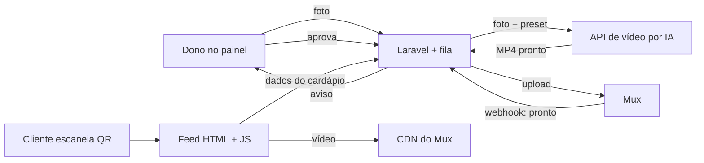

# Documentação Completa — Cardápio Digital em Vídeo

2026-09-21 · @Someone

## Visão geral

Plataforma própria de cardápio digital em vídeo, no estilo Instagram Reels. O cliente escaneia o QR Code na mesa e cai num feed vertical com um prato por tela. Para cada prato, o dono escolhe: subir uma foto, que uma IA transforma em um vídeo curto sempre no mesmo estilo, ou subir um vídeo próprio.

**Decisões tomadas até aqui**

| Tema | Decisão |
| --- | --- |
| Função | Só visualização; o pedido continua com o garçom |
| Formato | Feed vertical estilo Reels, acesso por QR, sem app para baixar |
| Navegação | Categorias fixas no topo; trocar de categoria troca os vídeos do feed |
| Plataforma | Totalmente nossa, sem YouTube |
| Origem do vídeo | Duas opções por prato: foto enviada pelo dono → vídeo gerado por IA com preset fixo, ou vídeo próprio enviado pelo dono |
| Modelo comercial | SaaS com assinatura pela Stripe; plano gratuito e planos pagos com limite de gerações de vídeo |
| Painéis | Painel do restaurante (dono) + painel administrativo do sistema (super admin) |
| Hospedagem | Mux (plano B: Cloudflare Stream) |
| Stack | Laravel + Livewire no painel; feed leve em HTML + JS; Laravel Cloud |
| Estratégia | Validar com restaurantes reais antes de construir tudo |

## Problema e proposta de valor

Cardápio de papel ou PDF não mostra o prato de verdade, dá trabalho para atualizar e não gera nenhuma informação para o dono. Produzir vídeo dos pratos é caro e fora da realidade de restaurante pequeno.

**Para o cliente na mesa:** vê o prato "vivo" em vídeo, num formato que já sabe usar.

**Para o dono do restaurante:**

- Cardápio com cara moderna sem precisar gravar nada: só tirar foto.
- Destacar os pratos que quer vender, na ordem que quiser.
- Mudar preço ou marcar esgotado na hora, sem reimprimir.
- Saber quais pratos chamam mais atenção (mais vistos e tempo assistido).

## Público-alvo e mercado

Restaurantes, lanchonetes, bares, pizzarias e hamburguerias com atendimento na mesa. Perfil ideal: se preocupa com imagem e redes sociais, mas não tem estrutura para produzir vídeo.

Começo em Ji-Paraná para validação presencial. Como o vídeo é gerado por IA a partir de foto, a implantação não depende de ir ao local, e o produto pode ser vendido online para qualquer cidade depois da validação.

## Referência e diferencial

Referência: Brasil4Food Menu, cardápio em vídeo usando vídeos hospedados no YouTube, gravados para cada restaurante.

| Ponto | Referência | Nós |
| --- | --- | --- |
| Hospedagem | YouTube | Própria (Mux) |
| Tela | Marca e sugestões do YouTube | Limpa, só a marca do restaurante |
| Produção do vídeo | Gravação | Foto + IA em minutos, ou vídeo próprio |
| Escala | Limitada por gravação | Venda online, qualquer cidade |
| Dados | Ficam no YouTube | Nossos, por prato |

## Escopo do produto

**Cardápio (cliente)**

- Feed vertical, um prato por tela, rolagem estilo Reels.
- Barra de categorias fixa no topo, com rolagem lateral; tocar numa categoria troca os vídeos do feed e volta ao primeiro prato dela.
- Vídeo em autoplay mudo e em loop, com botão de som.
- Nome, preço e descrição curta sobre o vídeo; detalhe completo num painel que sobe de baixo.
- Selos (novo, mais pedido, vegetariano) e prato esgotado sinalizado.
- Marca do restaurante: logo e cor de destaque.

**Fora do escopo**

- Pedido, carrinho, envio para cozinha ou WhatsApp.
- Pagamento e delivery.
- App nativo nas lojas.
- Modelo 3D interativo do prato (possível evolução futura).

## Geração de vídeo com IA

O dono envia uma foto do prato e um modelo de IA de imagem para vídeo gera um clipe curto, sempre com o mesmo preset visual.

**Preset padrão**

| Item | Padrão |
| --- | --- |
| Movimento | Câmera girando devagar 30–45° em volta do prato, com leve aproximação |
| Efeitos | Vapor ou brilho sutil quando fizer sentido |
| Duração | 5 a 10 segundos, pensado para loop |
| Formato | Vertical 9:16 |
| Prompt | Fixo por preset; o dono não escreve prompt |

**Regras**

- Não fazer giro 360° a partir de uma foto só: a IA teria que inventar o lado de trás do prato.
- Aceitar 1 foto; incentivar 3 ou 4 ângulos para resultados melhores.
- Gerar 2 ou 3 variações por prato; o dono escolhe uma ou pede para gerar de novo.
- Nada vai ao ar sem aprovação do dono.
- O vídeo não pode mostrar o prato diferente do real (risco de reclamação e de propaganda enganosa).

**Custo de referência:** cerca de $0,05 por segundo de vídeo gerado (Runway Gen-4 Turbo, set/2026). Um cardápio de 30 pratos com clipes de 10 s fica em torno de $15, uma vez só, sem contar regenerações.

**Vídeo próprio:** o dono também pode enviar um vídeo gravado por ele. O vídeo vai direto para o Mux, sem passar pela IA e sem custo de geração. Recomendações mostradas no envio: vertical, 5 a 15 segundos, prato em destaque; vídeos mais longos são cortados ou recusados.

**Gravação real** feita por nós continua existindo como serviço premium opcional.

## Arquitetura técnica

| Parte | Tecnologia | Observação |
| --- | --- | --- |
| Painel do restaurante | Laravel + Livewire | Mobile-first |
| Feed do cliente | HTML do servidor + JS leve (CSS scroll-snap, IntersectionObserver) | Sem Livewire no feed, para rolar liso |
| Fila | Laravel Queues | Geração por IA e upload são assíncronos |
| Geração de vídeo | API de imagem para vídeo (Runway, Veo, Kling ou similar) | Escolha após teste de qualidade |
| Vídeo | Mux | Armazena, converte e entrega |
| Infra | Laravel Cloud | Vídeo nunca fica no servidor da aplicação |

**Fluxo de um prato novo:** foto enviada → job na fila chama a IA com o preset → MP4 vai para o Mux → webhook do Mux marca o vídeo como pronto → dono aprova → prato aparece no feed. Com vídeo próprio, o upload vai direto do celular para o Mux, sem passar pela IA nem pelo servidor.

## Hospedagem de vídeo

Preços de referência levantados em setembro de 2026; conferir nos sites antes de contratar.

| Opção | Cobrança | Preço de referência | Observação |
| --- | --- | --- | --- |
| **Mux** | Por minuto | 100 mil min entregues/mês grátis; codificação básica grátis; armazenamento \~$0,003/min/mês | Plano grátis só até 10 vídeos; pay-as-you-go com $20 de crédito/mês |
| Cloudflare Stream | Por minuto | $5 por 1.000 min guardados; $1 por 1.000 min entregues | Simples e previsível; só H.264 até 1080p; não devolve o original |
| api.video | Por minuto | $0,00285/min guardado; $0,0017/min entregue | Mais caro na entrega |
| Bunny Stream | Por GB | $0,045/GB na América do Sul (rede padrão) | Barato em EUA/Europa; a rede Volume tem poucos pontos de entrega |
| Panda Video | Planos por banda | Cobrado em reais | Focado em infoprodutor |
| R2 + ffmpeg | Por GB guardado | Sem custo de banda de saída | Mais barato em escala, mas tudo feito por nós |

**Simulação:** 50 restaurantes, 30 pratos, 1.000 acessos/mês cada, \~10 vídeos vistos por acesso ≈ 100 mil minutos assistidos por mês.

| Opção | Custo mensal estimado |
| --- | --- |
| Mux | \~$1 (dentro da franquia) |
| Bunny Stream | \~$50 |
| Cloudflare Stream | \~$105 |
| api.video | \~$170 |

**Decisão:** começar com Mux. Acima de \~150–200 restaurantes, comparar a fatura real com Bunny e avaliar R2 + ffmpeg.

## Performance: vídeo na abertura

O objetivo é o cliente escanear e ver o prato na hora. Isso depende mais da implementação do que do provedor.

| Técnica | Como |
| --- | --- |
| Capa primeiro | HTML já vem do servidor com a capa do primeiro prato |
| Conexão antecipada | `preconnect` para o CDN do Mux no HTML |
| Primeiro vídeo junto com a página | Link do vídeo inicial já no HTML, sem esperar o JS |
| MP4 nos clipes curtos | MP4 otimizado (faststart) começa mais rápido que HLS |
| Começar em qualidade baixa | 480p no início, sobe para 720p |
| Pré-carga limitada | Só os próximos 1 ou 2 vídeos |
| Página leve | Pouco JavaScript no feed |
| Cache | Service worker guarda capas e primeiro vídeo para quem volta |

**Metas:** capa em menos de 1 s; vídeo tocando em menos de 2 s no 4G; troca de prato instantânea.

**Teste:** subir os mesmos 5 vídeos no Mux e no Cloudflare e medir no celular, no 4G, em Ji-Paraná.

## Painel do restaurante

Usado pelo dono no celular. Simples e direto.

| Tela | O que tem |
| --- | --- |
| Início | Ver cardápio, atalhos, resumo de visualizações, vídeos aguardando aprovação, gerações restantes no mês |
| Categorias | Criar, renomear, ocultar, arrastar para reordenar |
| Pratos | Lista por categoria com miniatura, preço e status |
| Criar / editar prato | Fotos, nome, preço, descrições, selos, variações |
| Vídeo do prato | Escolher entre gerar com IA ou enviar vídeo próprio; status, variações para escolher, gerar de novo, aprovar; mostra quantas gerações vão ser usadas |
| Aparência | Logo, cor de destaque, fonte, com prévia ao vivo |
| QR Code | QR para imprimir e modelo de display de mesa |
| Visualizações | Pratos mais vistos e tempo médio assistido |
| Assinatura | Plano atual, uso de gerações no mês, fazer upgrade, comprar gerações extras, faturas e cartão (portal da Stripe) |

A especificação visual detalhada está na Documentação de Design.

## Painel administrativo (super admin)

Painel exclusivo do dono do sistema, separado do painel dos restaurantes (área `/admin`, acesso só para usuários com papel `super_admin`). Sugestão de implementação: Filament, que é baseado em Livewire e acelera muito telas de gestão.

| Tela | O que tem |
| --- | --- |
| Dashboard | Receita recorrente mensal (MRR), clientes ativos por plano, novos e cancelados no mês, conversão do grátis para pago |
| Restaurantes | Lista com plano, status, uso; ver detalhes, suspender, reativar, entrar como o dono (impersonar) para suporte |
| Usuários | Contas dos donos, redefinir acesso, bloquear |
| Planos e limites | Criar e editar planos, preço, gerações por mês, limite de pratos, recursos liberados; vincular ao preço na Stripe |
| Assinaturas | Status de cada assinatura (ativa, em atraso, cancelada), histórico de pagamentos |
| Gerações de vídeo | Fila, erros, reprocessar, custo por geração e custo total no mês |
| Presets de IA | Editar prompt, movimento, duração e provedor de cada preset |
| Moderação | Ver fotos e vídeos enviados, remover conteúdo impróprio |
| Custos | Gasto com IA e Mux no mês comparado com a receita |
| Cupons | Criar cupons de desconto (sincronizados com a Stripe) |
| Logs | Ações importantes: mudanças de plano, suspensões, impersonações |

## Assinaturas e planos (Stripe)

O produto funciona como SaaS: o dono cria a conta sozinho, começa no plano gratuito e faz upgrade pelo painel.

**Planos (sugestão inicial, valores em aberto)**

| Recurso | Grátis | Básico | Pro |
| --- | --- | --- | --- |
| Preço | R$ 0 | R$ 69/mês | R$ 129/mês |
| Pratos no cardápio | até 15 | até 60 | ilimitado |
| Gerações de vídeo por IA | 5 no total (degustação) | 30 por mês | 100 por mês |
| Vídeo próprio | Sim | Sim | Sim |
| Marca "feito com" no cardápio | Sim | Não | Não |
| Visualizações | Total do cardápio | Por prato | Por prato + tempo assistido |
| Gerações extras | Compra avulsa | Compra avulsa | Compra avulsa |

**Regras de geração**

- 1 geração = 1 clipe gerado. Pedir 3 variações de um prato consome 3 gerações.
- O painel mostra o saldo antes de gerar e bloqueia quando zera, oferecendo upgrade ou pacote extra.
- Nos planos pagos o saldo renova todo mês, na renovação da assinatura; saldo mensal não acumula.
- Gerações compradas avulsas não expiram e são usadas depois do saldo mensal.
- Geração que falhar por erro do provedor não consome saldo.

**Integração com a Stripe**

| Parte | Como |
| --- | --- |
| Biblioteca | Laravel Cashier (Stripe) |
| Assinar / upgrade | Stripe Checkout em modo assinatura, em reais (BRL) |
| Cartão, faturas, cancelamento | Portal do cliente da Stripe, aberto pelo painel |
| Pacotes de gerações extras | Stripe Checkout em modo pagamento único |
| Sincronização | Webhooks: pagamento confirmado, assinatura criada/alterada/cancelada, pagamento falhou |
| Renovação de saldo | No webhook de fatura paga, zera e recarrega as gerações do mês |

**Inadimplência:** a Stripe tenta cobrar de novo por alguns dias; se não pagar, o restaurante volta para o plano gratuito em vez de o cardápio sair do ar. Pratos acima do limite ficam ocultos até regularizar.

**Formas de pagamento:** cartão de crédito no início. Verificar na Stripe o suporte atual a Pix e boleto em cobrança recorrente antes de prometer ao cliente.

## Mockups de referência

Aguardando os 2 mockups de exemplo:

1. **Gerenciamento do dono do restaurante:** como deve ser o painel.
2. **Abertura do cardápio pelo QR Code:** o que o cliente vê ao escanear.

Quando chegarem, entram aqui com as observações do que seguir de cada um.

## Modelo de dados

| Tabela | Campos principais |
| --- | --- |
| `restaurants` | id, nome, slug, logo, cor\_destaque, fonte, plan\_id, status (ativo, suspenso), stripe\_id (Cashier) |
| `users` | id, restaurant\_id (nulo para super admin), nome, email, senha, papel (dono, super\_admin) |
| `plans` | id, nome, preco, stripe\_price\_id, geracoes\_mes, geracoes\_iniciais, limite\_pratos, remove\_marca, nivel\_metricas, ativo |
| `subscriptions` / `subscription_items` | Tabelas padrão do Laravel Cashier |
| `generation_balances` | id, restaurant\_id, saldo\_mensal, saldo\_avulso, renova\_em |
| `generation_ledger` | id, restaurant\_id, tipo (renovacao, compra, uso, estorno), quantidade, referencia, criado\_em |
| `categories` | id, restaurant\_id, nome, ordem, visivel |
| `dishes` | id, restaurant\_id, category\_id, nome, preco, descricao\_curta, descricao, ordem, status (ativo, esgotado, oculto), selos (json) |
| `dish_variants` | id, dish\_id, nome, preco |
| `dish_photos` | id, dish\_id, caminho, ordem |
| `ai_presets` | id, nome, prompt, movimento, duracao, provedor, ativo |
| `video_generations` | id, dish\_id, preset\_id, provedor, status (fila, gerando, pronto, erro), custo, criado\_em |
| `videos` | id, dish\_id, origem (ia, upload), generation\_id (só quando ia), mux\_asset\_id, mux\_playback\_id, capa\_url, duracao, status (processando, aguardando\_aprovacao, aprovado, rejeitado) |
| `dish_views` | id, dish\_id, restaurant\_id, sessao, segundos\_assistidos, criado\_em |
| `admin_logs` | id, user\_id, acao, alvo, dados (json), criado\_em |

Cada prato tem no máximo um vídeo aprovado ativo. `dish_views` deve ser gravada em lote (ou agregada por dia) para não pesar no banco.

## Modelo de negócio e custos

**Receita**

- Assinatura mensal via Stripe, com plano gratuito como porta de entrada (detalhes na seção Assinaturas e planos).
- Pacotes avulsos de gerações de vídeo.
- Gravação real como serviço premium opcional.

**Referências de mercado:** iFood Cardápio Digital a partir de R$ 24,90/mês; Menu Digital (com fotos e vídeos) a partir de R$ 89/mês.

**Custos por restaurante (estimativa)**

| Item | Custo |
| --- | --- |
| Geração inicial (30 pratos) | \~$15 uma vez, mais regenerações |
| Hospedagem de vídeo | \~R$ 0 dentro da franquia do Mux; depois, poucos reais/mês |
| Infra (Laravel Cloud) | Custo fixo dividido entre todos os clientes |

**Exemplo:** 20 clientes a R$ 79 = cerca de R$ 1.600/mês de receita recorrente, com custo variável baixo.

## Riscos e mitigação

| Risco | Mitigação |
| --- | --- |
| Dono ver o cardápio como "enfeite" e cancelar | Mostrar dados: pratos mais vistos, tempo assistido |
| Vídeo de IA com cara artificial | Preset testado, movimento curto, várias variações, aprovação do dono |
| Vídeo diferente do prato real | Proibir giro 360° com uma foto; dono aprova tudo |
| Foto ruim tirada pelo dono | Guia de como fotografar dentro do painel |
| Concorrência gratuita ou barata | Diferencial no vídeo sem esforço para o dono |
| Custo da IA subir | Limite de gerações por plano e créditos extras |
| Custo de banda ao crescer | Travar em 720p; migrar para Bunny ou R2 se compensar |
| Dependência de fornecedor | Guardar a foto e o MP4 gerado do nosso lado |

## Validação e roadmap

**Fase 0 — Testes rápidos (1 semana)**

- [ ] Gerar vídeos de 5 pratos a partir de fotos reais de celular, com o mesmo preset.
- [ ] Mostrar os vídeos para 2 ou 3 donos e ver se parecem apetitosos ou artificiais.
- [ ] Medir abertura do feed no 4G com Mux e Cloudflare.

**Fase 1 — Piloto (30 a 60 dias)**

- [ ] Protótipo do feed com o cardápio de 2 ou 3 restaurantes reais, grátis.
- [ ] Medir acessos e vídeos vistos.
- [ ] Mostrar a demo para mais \~10 donos.
- [ ] No fim, perguntar se pagariam e quanto.

**Critério para seguir:** pelo menos 3 de 10 donos querendo pagar.

**Fase 2 — MVP**

- [ ] Painel do restaurante, geração por IA com aprovação, upload de vídeo próprio, integração com Mux, QR Code, visualizações.
- [ ] Assinaturas com Stripe (Cashier), planos, saldo de gerações e pacotes extras.
- [ ] Painel administrativo com restaurantes, planos, assinaturas, gerações e custos.
- [ ] Primeiros clientes pagantes em Ji-Paraná.

**Fase 3 — Escala**

- [ ] Cadastro e implantação self-service para vender online.
- [ ] Revisar custos de hospedagem e IA com volume real.

## Decisões em aberto

- Qual modelo de IA de imagem para vídeo usar (decidir após o teste de qualidade).
- Preços finais dos planos e limites de gerações e pratos em cada um.
- Plano gratuito com 5 gerações só uma vez ou renovando todo mês (custo da IA x conversão).
- Preço dos pacotes avulsos de gerações.
- Pix ou boleto na assinatura, conforme suporte da Stripe.
- MP4 ou HLS no feed (decidir após medir no 4G).
- Nome e marca do produto.
- Se o giro maior com 3 ou 4 fotos entra no MVP ou depois.
- Ajustes de telas após receber os 2 mockups de referência.
